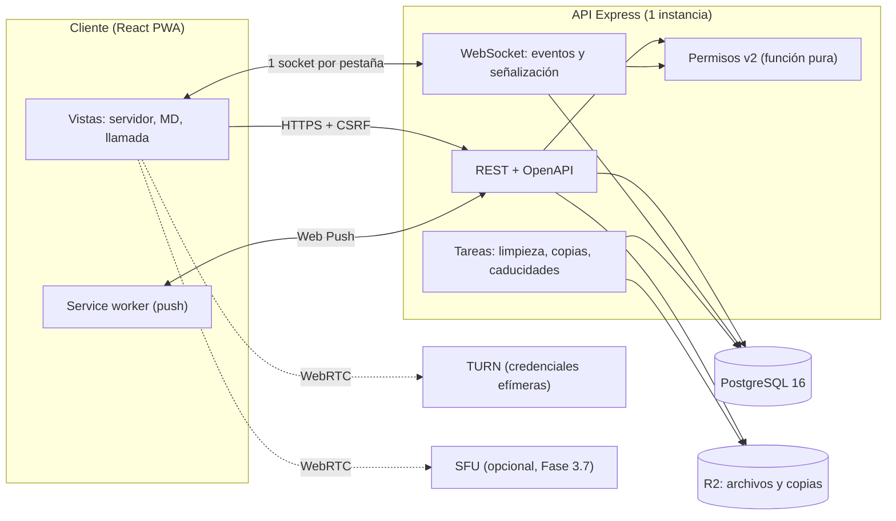
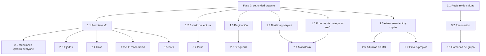

# Plan de plataforma: paridad comparable con Discord

**Estado a 27 de septiembre de 2026.** Documento vivo: se actualiza cuando termina cada fase.

## 0. Resumen

A.N.O.T.H.E.R. ya cubre lo que un grupo de amigos usa a diario en Discord: servidores, canales de texto y voz, mensajes directos, llamadas con pantalla compartida, soundboard, eventos, historias y clips. Lo que falta para una paridad **comparable** se agrupa en seis fases:

| Fase | Tema | Por qué en este orden | Tamaño |
|---|---|---|---|
| **0** | Seguridad urgente | Hay cuatro fallos verificados que exponen datos o permiten saltarse invitaciones | 4 PR pequeños |
| **1** | Cimientos | Permisos v2, estado de lectura, paginación, división de la interfaz, almacenamiento persistente y pruebas de navegador en CI. Todo lo demás se apoya en esto | 6–8 PR |
| **2** | Mensajería | Formato, menciones de rol y @everyone, fijados, hilos, adjuntos y edición en mensajes directos, búsqueda seria | 7–9 PR |
| **3** | Voz y vídeo | Reconexión sin cortes, silenciar el sonido, pulsar para hablar, TURN, llamadas de grupo y evaluación de un SFU | 5–7 PR |
| **4** | Comunidad y moderación | Roles con jerarquía, expulsiones y baneos por servidor, aislamientos temporales, filtros activos, auditoría completa, invitaciones con caducidad, emojis propios | 6–8 PR |
| **5** | Plataforma | PWA y notificaciones push, seguridad de cuenta (contraseña, sesiones, 2FA), webhooks y bots, idioma y accesibilidad | 6–8 PR |

**Paridad comparable no significa copiar Discord entero.** La sección 10 explica qué no se copia y por qué: Nitro, descubrimiento público, «boosts», escenarios de radio, etc.

Cada PR sigue [`AGENTS.md`](../AGENTS.md): un tema por PR, pruebas con actores no administradores e IDs que no coinciden, comprobación por mutación, pruebas de navegador para la interfaz, y ningún merge propio.

---

## 1. Principios de diseño

1. **Grupo pequeño y de confianza.** Se optimiza para decenas de usuarios, no para millones. Esto permite una sola instancia y decisiones simples, y deja fuera la moderación a escala.
2. **Privacidad primero.** Los mensajes se cifran en reposo (AES-256-GCM). Ninguna función nueva debe guardar texto en claro, filtrar canales restringidos ni enviar datos a terceros sin consentimiento explícito.
3. **Una sola instancia mientras se pueda.** El estado de voz, las llamadas, los límites y el visionado viven en memoria. Pasar a varias instancias es opcional (sección 9.2).
4. **Coste cercano a cero.** Replit más servicios gratuitos o baratos. Cada pieza de pago (TURN, SFU, almacenamiento) se decide aparte y con estimación.
5. **El servidor es la fuente de verdad.** La interfaz nunca decide permisos. Todo identificador que llega del cliente se valida contra su recurso (`AGENTS.md` §7.2).
6. **Móvil de primera clase.** Todo se prueba a 390 px. Colgar y expandir están siempre visibles. Ninguna función existe solo en escritorio.
7. **Contrato primero.** Cada ruta nueva o cambiada entra en `openapi.yaml` y se regenera el cliente.

---

## 2. Estado actual (inventario verificado)

Hecho con una lectura completa del código de `main` más los PR #8 a #10. Las afirmaciones de seguridad se comprobaron a mano. **Existe**: completo. **Parcial**: con límites importantes. **Falta**: no existe.

| Área | Existe | Parcial | Falta |
|---|---|---|---|
| Cuentas | Registro por invitación, login, sesiones en Postgres, CSRF, panel de admin global | El baneo global no cierra sesiones abiertas | Cambio o recuperación de contraseña, 2FA, email, borrar cuenta, gestión de sesiones |
| Perfil | Avatar, banner, bio, estado, estado personalizado, enlaces, amigos | Presencia automática con límites conocidos (plan de presencia, PR B) | Bloquear usuarios, pronombres |
| Servidores | Crear, borrar, salir, invitaciones, icono y banner | Invitaciones de un solo uso, sin caducidad al crearlas | Transferir la propiedad, plantillas |
| Roles y permisos | Roles con color, 4 permisos, dueño, admin y miembro | `restrictedRoles` solo permite dar acceso; `position` sin jerarquía | Expulsar y banear por servidor (los bits existen, pero ninguna ruta los usa), permisos por canal, @everyone |
| Canales | Texto, voz, media, calendario, categorías, gestión desde la barra (D1 y D2) | Los no leídos solo se cuentan en memoria del navegador | Tema o descripción, modo lento, fijados, hilos, foros, anuncios |
| Mensajes | Enviar, editar, borrar, responder, reacciones, adjuntos, GIF, vista previa de enlaces, cifrado, reportes | Menciones solo `@usuario` y sin resaltar; búsqueda que descifra y recorre; historial sin paginar en el cliente | Markdown y bloques de código, @rol, @everyone, emojis propios, stickers |
| Mensajes directos | 1:1, grupos, reacciones, llamadas 1:1 | Historial fijo de 50 | Editar mensajes, adjuntos, llamadas de grupo |
| Voz y vídeo | Canales de voz, cámara, pantalla con audio, supresión de ruido, volumen por persona, soundboard, visionado (YouTube y SoundCloud) | Solo STUN; malla punto a punto | Silenciar el sonido de la llamada, pulsar para hablar, reconexión sin corte, SFU |
| Notificaciones | Del navegador, niveles por servidor y canal, insignias | Preferencias solo en `localStorage` | Service worker, push, preferencias en el servidor |
| Archivos | Disco local, biblioteca con VirusTotal, historias, clips | Adaptador R2 escrito pero sin conectar | Copias de seguridad, limpieza de huérfanos |
| Tiempo real | Un WebSocket por pestaña, señalización dirigida, `channels:changed` | Todo el estado en memoria (una instancia) | Pub/sub entre instancias |
| Integraciones | — | — | Webhooks, bots, tokens de API, comandos |
| Cliente | Diseño móvil, ARIA en buena parte | Atajos de teclado mínimos | PWA, idioma declarado (`lang="en"` con la interfaz en español), app de escritorio |
| Calidad | CI (typecheck, codegen, migraciones, builds, suite de 9 escenarios), límites de tasa, pino | Contrato incompleto (amigos, moderación, historias, clips) | Pruebas de navegador en CI, copias de seguridad |

---

## 3. Fase 0 — Seguridad urgente

**Van antes que cualquier función nueva.** Los cuatro fallos están verificados leyendo el código. Cada uno es un PR pequeño, con su prueba y su comprobación por mutación.

### 0.1 Unirse a cualquier servidor sin invitación
- **Hoy:** `POST /servers/:serverId/join` (`routes/servers.ts`) inserta al usuario como miembro de cualquier servidor que exista, sin comprobar ninguna invitación. Los identificadores son consecutivos, así que se pueden recorrer.
- **Arreglo:** eliminar la ruta si no la usa la interfaz, o exigir una invitación válida. La única vía para entrar es `join-by-invite`. El servidor «General» sigue con su lógica propia (`lib/general-server.ts`).
- **Prueba:** un usuario no miembro llama a `/servers/:id/join` con el id de otro servidor y recibe 404 o 403, sin fila en `server_members`. **Mutación:** restaurar la ruta tal cual hace fallar la prueba.

### 0.2 La búsqueda filtra canales restringidos
- **Hoy:** `GET /servers/:serverId/search` y la búsqueda por canal solo comprueban que el usuario es miembro del servidor, no `canAccessChannel`. Un miembro sin el rol ve en los resultados mensajes de canales restringidos.
- **Arreglo:** filtrar los canales con `canAccessChannel` antes de descifrar. La búsqueda por canal devuelve 403 si no hay acceso.
- **Prueba:** canal restringido a un rol; un miembro sin el rol busca una palabra que solo existe allí y obtiene 0 resultados; con el rol, 1. Actor no administrador e IDs distintos. **Mutación:** quitar el filtro hace fallar la prueba.

### 0.3 El baneo global no corta sesiones
- **Hoy:** `routes/admin.ts` marca `users.banned`, pero `requireAuth` solo mira la sesión y el WebSocket sigue abierto. El baneado sigue usando la app hasta que cierra sesión.
- **Arreglo:**
  - al banear, destruir sus sesiones en el almacén de Postgres (`session` con `sess->>'userId'`) y cerrar sus WebSockets con un código propio;
  - `requireAuth` rechaza a los usuarios con `banned = true`, como defensa en profundidad;
  - el cliente muestra «Tu cuenta ha sido baneada».
- **Prueba:** banear a un usuario con sesión y WebSocket abiertos → su siguiente petición da 401 o 403 y su socket se cierra. **Mutación:** sin destruir sesiones, la prueba falla.

### 0.4 Los filtros de palabras no se aplican
- **Hoy:** existe el CRUD de filtros (`routes/moderation.ts`) con interfaz en Configuración → Filtros, pero ninguna ruta de mensajes los consulta.
- **Arreglo:** aplicar los filtros del servidor en `POST` y `PATCH` de mensajes de canal. Se recomienda **bloquear** con un 400 que explique el motivo, antes que censurar en silencio. El cliente muestra el mensaje real.
- **Decisión de Nico (F1):** ¿bloquear, o reemplazar por asteriscos? ¿Aplicarlos también a mensajes directos (hoy no pertenecen a ningún servidor)?
- **Prueba:** una palabra filtrada da 400 y no se guarda; un texto limpio da 201. **Mutación:** quitar la comprobación hace fallar la prueba.

### 0.5 Menores (mismo bloque, PR aparte)
- `SESSION_SECRET` recurre a un valor fijo si falta la variable (`lib/session-config.ts`). En producción debe **fallar al arrancar**, igual que `MESSAGE_ENCRYPTION_KEY` (`AGENTS.md` §7.5).
- `moderation.ts` acepta un rol `moderator` que no se puede asignar desde ninguna ruta. Se quita o se implementa en la Fase 4.
- Los mensajes de error de la API de eventos están en inglés.

---

## 4. Fase 1 — Cimientos

Sin esto, las fases 2 a 5 son más caras y frágiles.

### 1.1 Permisos v2 (el cambio más importante)
**Objetivo:** un modelo como el de Discord, reducido a lo que se usa.

**Permisos (bits, `bigint`):**

| Grupo | Permisos |
|---|---|
| General | `VIEW_CHANNEL`, `MANAGE_CHANNELS`, `MANAGE_ROLES`, `MANAGE_SERVER`, `CREATE_INVITE`, `VIEW_AUDIT_LOG` |
| Miembros | `KICK_MEMBERS`, `BAN_MEMBERS`, `TIMEOUT_MEMBERS`, `MANAGE_NICKNAMES` |
| Texto | `SEND_MESSAGES`, `SEND_IN_THREADS`, `CREATE_THREADS`, `EMBED_LINKS`, `ATTACH_FILES`, `ADD_REACTIONS`, `MENTION_EVERYONE`, `MANAGE_MESSAGES`, `PIN_MESSAGES`, `READ_HISTORY` |
| Voz | `CONNECT`, `SPEAK`, `VIDEO`, `STREAM` (pantalla), `USE_SOUNDBOARD`, `START_WATCH`, `MUTE_MEMBERS`, `MOVE_MEMBERS` |
| Especial | `ADMINISTRATOR` (lo concede todo, salvo lo reservado al dueño) |

**Modelo de datos (migración generada):**
- `server_roles`: se añaden `permissions bigint`, `position int` con jerarquía real y `is_everyone boolean` (un rol @everyone por servidor, creado en la migración).
- `channel_permission_overwrites (channel_id, target_type: role|member, target_id, allow bigint, deny bigint)`, con clave primaria compuesta y FK con `on delete cascade`.
- También a nivel de categoría (`category_permission_overwrites`) y sincronización opcional de los canales con su categoría.

**Algoritmo** (el mismo que Discord, en una función pura con pruebas unitarias exhaustivas):
1. El dueño lo tiene todo.
2. `base` = permisos de @everyone | OR de los permisos de los roles del miembro.
3. Si `base` incluye `ADMINISTRATOR` → todo.
4. Se aplica la sobrescritura @everyone del canal: `(base & ~deny) | allow`.
5. Se aplican las sobrescrituras de roles del miembro, con el OR de todos sus `deny` y el OR de todos sus `allow`.
6. Se aplica la sobrescritura del propio miembro.
7. Sin `VIEW_CHANNEL`, todo lo del canal queda denegado.

**Jerarquía:** solo se puede gestionar, asignar, expulsar o banear a alguien cuyo rol más alto quede por debajo del tuyo.

**Migración de datos desde `restrictedRoles`:** un canal con `restrictedRoles = [A, B]` pasa a tener un deny de `VIEW_CHANNEL` para @everyone y un allow de `VIEW_CHANNEL` para A y B. El comportamiento es idéntico y se prueba con los mismos escenarios de hoy. La columna antigua se borra en un PR posterior, cuando nada la lea.

**Puntos donde se aplica:** todas las rutas y eventos de WebSocket (suscripción, voz, soundboard, visionado). `canAccessChannel` pasa a ser `hasChannelPermission(member, channel, VIEW_CHANNEL)`.

**Interfaz:** en Configuración → Roles, arrastrar para ordenar y marcar permisos por grupos. En el menú del canal (D2), una pestaña «Permisos» con sobrescrituras por rol y por miembro: permitir, heredar o denegar.

**Pruebas:**
- tabla de verdad del algoritmo;
- el mismo escenario con rol permitido, rol denegado, miembro con allow que gana a un deny de rol, y ADMINISTRATOR;
- mutaciones sobre cada paso del algoritmo.

### 1.2 Estado de lectura en el servidor
- Tabla `channel_read_states (user_id, channel_id, last_read_message_id, mention_count)`.
- `POST /channels/:id/ack` al ver el canal. Los no leídos y las menciones se calculan en el servidor, para que valgan en todos los dispositivos.
- El cliente deja de contar en memoria.

### 1.3 Historial paginado
- El cliente pide páginas con `before` al hacer scroll hacia arriba (`useInfiniteQuery`) y mantiene la posición.
- Los mensajes directos y los grupos, también: hoy tienen un tope fijo de 50.
- «Saltar al presente» y «saltar a un mensaje», necesario para las respuestas, la búsqueda y los fijados.

### 1.4 Dividir `app-layout.tsx` (2.500 líneas)
- Extraer por dominio: `server-view`, `dm-view`, `message-list`, `message-item`, `composer`, `call-layer`, `mobile-navigation`. Sin cambios de comportamiento; las pruebas de navegador son la red de seguridad.
- Un PR por extracción, cada uno con las pruebas de navegador en verde.

### 1.5 Almacenamiento persistente y copias de seguridad
- Conectar el adaptador R2 (`lib/storage/`) a todas las subidas: avatares, adjuntos, biblioteca, clips, historias y soundboard. Hoy, **cada redespliegue borra los archivos**.
- Autorizar cada descarga y servirla con URLs firmadas de corta duración o por un proxy de la API (se mantiene la regla de reautorizar en cada petición, `AGENTS.md` §7.4).
- Migrar los archivos existentes con un script idempotente.
- Copia de seguridad diaria de Postgres (exportación cifrada a R2, retención de 14 días) y un documento de cómo restaurarla, **probado**.
- Limpieza programada de adjuntos huérfanos (backlog).

### 1.6 Pruebas de navegador en CI
- Las pruebas de Playwright que ya existen (`scripts/e2e/`) pasan a ejecutarse en GitHub Actions con PostgreSQL 16 y Chromium: barra de canales, llamada en el móvil y chat en el móvil.
- A partir de aquí, todo PR de interfaz añade o actualiza su prueba de navegador.

### 1.7 Contrato completo
- Añadir a `openapi.yaml` amigos, moderación, historias, clips y subidas, y eliminar las llamadas con `csrfFetch` a mano cuando exista un hook generado.

---

## 5. Fase 2 — Mensajería

| PR | Qué | Notas clave |
|---|---|---|
| 2.1 Markdown seguro | Negrita, cursiva, tachado, `código`, bloques de código con resaltado, citas, listas, spoilers `\|\|texto\|\|`, enlaces | Renderizado propio o con `micromark` sin HTML. **Nunca** `dangerouslySetInnerHTML` sin sanear. Pruebas de XSS en la suite |
| 2.2 Menciones | `@usuario`, `@rol`, `@everyone`/`@here` con permiso `MENTION_EVERYONE`; resaltado de «te mencionaron»; autocompletado de roles | Las menciones se resuelven en el servidor a identificadores. El texto cifrado guarda los tokens `<@id>`, `<@&rol>` |
| 2.3 Fijados | Fijar y desfijar con `PIN_MESSAGES`, panel de fijados, aviso en el canal | Tabla `pinned_messages`. Máximo 50 por canal |
| 2.4 Hilos | Crear un hilo desde un mensaje, lista de hilos del canal, archivado automático | Un hilo es un canal hijo (`parent_channel_id`, `thread_owner_id`, `archived_at`) y reutiliza el modelo de mensajes y permisos |
| 2.5 Mensajes directos completos | Editar, adjuntos (misma validación y autorización que en canales), límite de tasa en grupos | Hoy no se pueden editar ni adjuntar |
| 2.6 Búsqueda seria | Filtros `de:`, `en:`, `tiene:archivo`, fechas; paginación; resultados que respetan permisos | Con cifrado en reposo no sirve la búsqueda de texto de Postgres sobre el cifrado. **Propuesta:** índice ciego con HMAC por palabra normalizada (clave separada) en `message_search_tokens`. Permite buscar sin guardar texto en claro, pero filtra la frecuencia de palabras. **Decisión F2** |
| 2.7 Emojis propios | Subir emojis por servidor (PNG/GIF ≤ 256 KiB, máximo 50), usarlos en mensajes y reacciones | Almacenamiento de la Fase 1.5 |
| 2.8 Tema, modo lento y anuncios | Tema del canal, modo lento por canal (segundos entre mensajes, exento `MANAGE_MESSAGES`) | El modo lento se aplica en el servidor |
| 2.9 Leído por | En mensajes directos: «visto» con el cursor de lectura ya existente | Opcional, con ajuste de privacidad |

---

## 6. Fase 3 — Voz y vídeo

| PR | Qué | Notas |
|---|---|---|
| 3.1 Registro de caídas (A1) | Registrar el motivo de cada cierre de conexión y llamada | Del plan de llamadas; es la base para medir |
| 3.2 Reconexión sin corte (A2) | Margen de 20 s: el cierre del WebSocket no expulsa ni cuelga, y se reengancha la señalización | Del plan de llamadas |
| 3.3 Silenciar el sonido y pulsar para hablar | Silenciar el sonido (no se oye a nadie), atajo configurable para hablar, indicador de quién habla | El indicador ya está en el backlog; analizar el audio remoto en el cliente |
| 3.4 TURN | Retransmisión para redes que no conectan con STUN | **Decisión F3:** Cloudflare TURN (credenciales efímeras emitidas por la API, **nunca** en `VITE_*`) o coturn propio |
| 3.5 Llamadas de grupo | Llamadas en grupos de mensajes directos, reutilizando la lógica de canales de voz | Señalización dirigida por conexión |
| 3.6 Calidad | Resolución y FPS de pantalla y cámara, uso de ancho de banda, estadísticas de la conexión | `RTCRtpSender.setParameters` |
| 3.7 Evaluar un SFU | Con una malla, más de 5 o 6 participantes con vídeo saturan la subida | **Decisión F4:** LiveKit (autoalojado o en la nube). Solo si el grupo lo necesita de verdad |

---

## 7. Fase 4 — Comunidad y moderación

| PR | Qué |
|---|---|
| 4.1 Expulsar y banear por servidor | Rutas que usan por fin `KICK_MEMBERS` y `BAN_MEMBERS`, con jerarquía, motivo, borrado opcional de mensajes recientes y tabla `server_bans` |
| 4.2 Aislamiento temporal | `TIMEOUT_MEMBERS`: el miembro no puede escribir, reaccionar ni hablar durante X minutos. Sustituye y unifica los «mutes» actuales |
| 4.3 Filtros y automoderación | Sobre 0.4: palabras, enlaces, spam por repetición, con exenciones por rol |
| 4.4 Registro de auditoría completo | Todas las acciones administrativas (canales, roles, permisos, expulsiones, invitaciones, filtros), con etiquetas en español en lugar de los códigos |
| 4.5 Invitaciones con opciones | Caducidad (30 min a nunca), usos máximos, invitación temporal, lista y revocación |
| 4.6 Transferir la propiedad y borrar la cuenta | Transferir el servidor; borrar la cuenta con claves foráneas y decisiones sobre su contenido (backlog) |
| 4.7 Apodos por servidor | `MANAGE_NICKNAMES` y el propio apodo |
| 4.8 Bloquear usuarios | El bloqueado no puede enviar mensajes directos, y sus mensajes se ocultan tras un aviso |

---

## 8. Fase 5 — Plataforma

| PR | Qué | Notas |
|---|---|---|
| 5.1 PWA | `manifest.webmanifest`, iconos, instalable en el móvil, `lang="es"` | Pantalla de inicio en Android e iOS |
| 5.2 Push | Service worker con Web Push (claves VAPID en secretos) para menciones, mensajes directos y llamadas entrantes. Preferencias guardadas en el servidor | Sin contenido del mensaje en la notificación salvo que el usuario lo permita (privacidad) |
| 5.3 Seguridad de cuenta | Cambiar la contraseña, cerrar otras sesiones, lista de sesiones, 2FA con TOTP y códigos de recuperación | No hay email: la recuperación va por códigos o por un reinicio del admin con registro de auditoría |
| 5.4 Webhooks entrantes | URL secreta por canal para que servicios externos publiquen | Límite de tasa y firma |
| 5.5 Bots | Cuentas bot con token, API REST y eventos por WebSocket con permisos v2 | Después de los webhooks |
| 5.6 Comandos | `/` con autocompletado para bots | Opcional |
| 5.7 Accesibilidad y atajos | Atajos (Ctrl+K para cambiar de canal, Alt+↑/↓), navegación completa con teclado, contraste | Auditoría con axe en las pruebas de navegador |
| 5.8 Idioma | Extraer textos a un catálogo, por si algún día se quiere otro idioma | Baja prioridad: el grupo habla español |

---

## 9. Arquitectura objetivo

### 9.1 Reglas que no cambian
- CSRF de doble envío, CORS del mismo origen, helmet, límites de tasa y manejador central de errores.
- Cifrado en reposo con clave obligatoria. Ninguna función nueva guarda texto en claro. La búsqueda usa el índice ciego (F2).
- Autorización en cada petición de archivo, también con R2.
- Señalización WebRTC dirigida por conexión, nunca difundida.

### 9.2 Escalar a varias instancias (solo si hace falta)
Hoy es imposible: la voz, las llamadas, el visionado y los límites viven en memoria. Si algún día hiciera falta:
- mover ese estado a Redis (con TTL);
- usar Redis pub/sub para difundir eventos entre instancias;
- enrutar la señalización por la conexión dueña.

Con el tamaño actual del grupo **no se recomienda**. Replit con «Max machines = 1» es suficiente.

---

## 10. Lo que no se copia de Discord (y por qué)

| Función | Motivo |
|---|---|
| Nitro, boosts, perfiles de pago | No hay modelo de negocio; en un grupo privado no aporta nada |
| Descubrimiento público de servidores | La plataforma es privada por invitación |
| Canales Stage | Pensados para audiencias grandes |
| Foros | Los hilos (2.4) cubren el caso; se reconsidera si el grupo lo pide |
| Actividades y juegos embebidos | Coste alto; el visionado conjunto ya cubre el caso principal |
| Tienda de stickers | Los emojis propios (2.7) bastan |
| Moderación con IA a escala | Grupo pequeño y de confianza |

---

## 11. Orden de ejecución y dependencias

**Trabajo en paralelo:** la Fase 3 (voz) no depende de las fases 1 y 2, salvo por los permisos de voz; puede avanzar con otro colaborador. Los PR que tocan `app-layout.tsx` no se hacen en paralelo hasta que 1.4 lo divida.

---

## 12. Cómo se verifica cada PR

Resumen de [`AGENTS.md`](../AGENTS.md) y de [`docs/instrucciones/verificacion.md`](instrucciones/verificacion.md):

1. Install con lockfile congelado, typecheck, builds, migraciones y codegen sin diferencias, y la suite completa, **ejecutados**, con la salida pegada en el PR.
2. Pruebas con un actor **no administrador**, IDs que **no coinciden** (`assert.notEqual`) y recursos de **otro servidor**.
3. **Mutación**: se reintroduce el fallo y la prueba tiene que fallar. Si no falla, no protege nada.
4. Interfaz: prueba de navegador a 1280 px y a 390 px táctil, con capturas en el PR, sin errores de JavaScript y sin desbordamiento horizontal. Colgar y expandir visibles y **sin tapar** (`elementFromPoint`).
5. Verificación independiente (Claude) antes del merge. Solo Nico fusiona.

---

## 13. Decisiones pendientes de Nico

| # | Decisión | Opciones | Propuesta |
|---|---|---|---|
| F1 | Filtros de palabras | Bloquear el mensaje o censurar con asteriscos; ¿también en mensajes directos? | Bloquear con un mensaje claro; no aplicarlos en mensajes directos |
| F2 | Búsqueda con cifrado | Índice ciego HMAC (filtra la frecuencia de palabras) o seguir descifrando y recorriendo (lento y limitado) | Índice ciego |
| F3 | TURN | Cloudflare (gratis hasta 1 TB/mes) o coturn propio | Cloudflare, con credenciales efímeras |
| F4 | SFU | Nunca, LiveKit en la nube o LiveKit propio | Decidir tras medir con el registro de caídas (3.1) |
| F5 | Orden de las fases 2 y 3 | Mensajería antes que voz, o al revés | Fase 0 y Fase 1 primero; después, en paralelo |
| F6 | Almacenamiento | R2 (sin coste de salida) u otro | R2 |

---

## 14. Relación con planes y documentos existentes

- [`docs/planes/llamadas-y-presencia.md`](planes/llamadas-y-presencia.md): PR C (hecho, #4), A1, A2 y B. A1 y A2 son las fases 3.1 y 3.2.
- [`docs/planes/gestion-de-canales.md`](planes/gestion-de-canales.md): D1 (hecho, #7), D2 (#8) y D3 (opcional).
- [`docs/auditoria-movil-2026-09.md`](auditoria-movil-2026-09.md): hallazgos del móvil y su estado (#8, #9 y #10).
- [`BACKLOG.md`](../BACKLOG.md): sus puntos quedan absorbidos por las fases 1.3, 1.4, 1.5, 3.2, 3.3 y 4.6.
